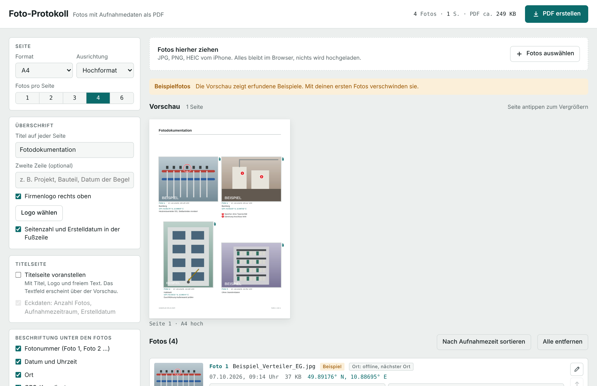
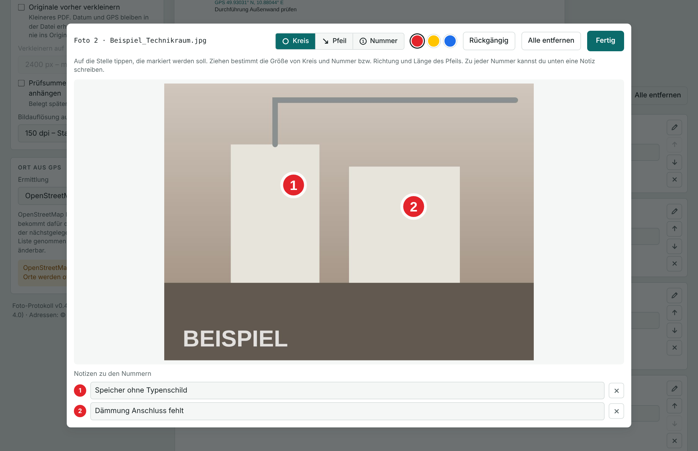
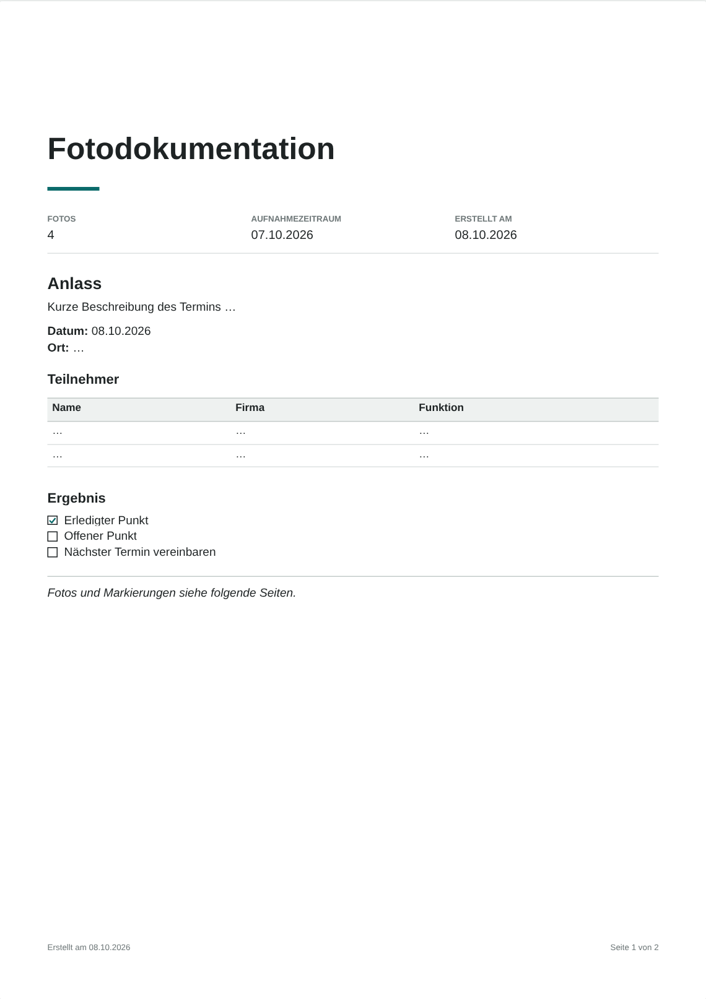
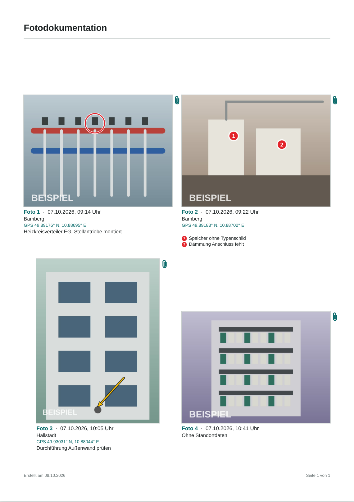

# Foto-Protokoll

Fotos per Drag & Drop in ein PDF: mit Datum, Uhrzeit, GPS-Position und Ort unter jedem Bild, wählbarem Seitenformat, Markierungen im Foto und den unveränderten Originaldateien im PDF. Gedacht für Baustellen-, Mängel- und Abnahmedokumentation.

Das Tool ist eine einzige HTML-Datei. Es läuft komplett im Browser, Fotos werden nirgendwo hochgeladen.



## Benutzen

| Weg | Ort aus GPS | Hinweis |
|---|---|---|
| **GitHub Pages** (wenn aktiviert) | Straße, Hausnummer, PLZ und Ort über OpenStreetMap | Einfach die Seite öffnen |
| **Lokal**: [`dist/Foto-Protokoll.html`](dist/Foto-Protokoll.html) herunterladen und doppelklicken | Straße, Hausnummer, PLZ und Ort über OpenStreetMap | Funktioniert ohne Server |
| **Als Claude-Artifact** | Nur nächster Ort aus der eingebauten Liste | Die Artifact-Umgebung blockiert fremde Server |

Ohne Internet bleibt alles nutzbar. Den Ort bestimmt das Tool dann offline aus der eingebauten Ortsliste („Bamberg“, „bei Pisa (1,5 km), Italien“). Beim ersten Öffnen werden die Bibliotheken für PDF und EXIF aus dem Netz geladen (cdnjs, jsDelivr).

## Funktionen

**Seiten**
- Format A4, A3, A5 oder US Letter, Hoch- oder Querformat
- 1, 2, 3, 4 oder 6 Fotos pro Seite, Live-Vorschau aller Seiten
- Überschrift und zweite Zeile auf jeder Seite, optional Firmenlogo rechts oben
- Fußzeile mit Seitenzahl und Erstelldatum

**Beschriftung unter jedem Foto** (jede Zeile einzeln abschaltbar)
- Fotonummer („Foto 3“) sowie Datum und Uhrzeit aus den EXIF-Daten
- Ort: über OpenStreetMap mit Straße und Hausnummer, sonst offline der nächste Ort. Pro Foto änderbar.
- GPS-Koordinaten, im PDF als Link zur Karte
- Bemerkung, Notizen zu nummerierten Markierungen, Dateiname

**Markieren im Foto**
- Kreis, Pfeil und Nummer ①②③ in Rot, Gelb oder Blau, jeweils mit Kontrastrand
- Zu jeder Nummer eine Notiz, die als Liste unter dem Foto steht
- Markierungen liegen als Vektorgrafik über dem Bild. Die eingebetteten Originale bleiben unverändert.



**Originale im PDF**
- Jede Originaldatei wird bitgenau als Anhang eingebettet, inklusive aller EXIF-Daten. Neben jedem Foto sitzt eine Büroklammer.
- Optional verkleinert auf 1600, 2400 oder 3200 px. Datum und GPS bleiben dabei in der Datei erhalten.
- Optional eine Prüfsummenseite (SHA-256) für jede Originaldatei als Echtheitsnachweis

> Die Anhänge zeigen Adobe Acrobat, Foxit, PDF-XChange und Firefox an. Der eingebaute PDF-Viewer von Chrome und Edge zeigt sie **nicht** an.

**Titelseite** (optional)
- Großer Titel, Logo und Eckdaten: Anzahl Fotos, Aufnahmezeitraum, Erstelldatum
- Freier Text mit Markdown. Langer Text läuft auf Folgeseiten weiter.

| Markdown | Ergebnis |
|---|---|
| `# Titel`, `## Abschnitt`, `### Unterabschnitt` | Überschriften |
| `**fett**`, `*kursiv*`, `***beides***`, `` `Code` `` | Hervorhebungen |
| `- Punkt`, `1. Punkt`, mit zwei Leerzeichen eingerückt | Listen bis zwei Ebenen |
| `- [ ] offen`, `- [x] erledigt` | Checkboxen |
| `\| Name \| Firma \|` + `\|---\|---\|` | Tabelle mit grauem Kopf |
| `---` | Trennlinie |

Abweichend vom Standard-Markdown bleibt jeder Zeilenumbruch erhalten. Eine Leerzeile beginnt einen neuen Absatz.

<p>
  
  
</p>

## Datenschutz

- Fotos, Markierungen und Notizen bleiben im Browser. Es gibt keinen Server und kein Tracking.
- Nur zur Ortsermittlung gehen die **GPS-Koordinaten** (nicht die Fotos) an OpenStreetMap Nominatim, höchstens eine Anfrage pro Sekunde. Mit der Einstellung „Nur offline“ oder „Aus“ geht nichts ins Netz.
- Einstellungen, Titelseitentext und Logo werden im Browser gespeichert (`localStorage`). Fotos und Markierungen nicht: Nach dem Neuladen sind sie weg.

## Entwicklung

```bash
npm install                 # Abhängigkeiten (pdf-lib, exifr und cities.json für Tests/Daten, Playwright)
npm run build               # src/ + data/ → dist/Foto-Protokoll.html und dist/artifact.html
pip install pillow piexif   # für die Testfotos
npm run fixtures            # Testfotos mit EXIF erzeugen
npx playwright install chromium
npm test                    # Build + End-to-End-Tests
node test/screenshots.mjs   # Bilder in docs/ neu erzeugen
npm run build:orte          # Offline-Ortsliste neu erzeugen (selten nötig)
```

Projektaufbau und Datenfluss beschreibt [docs/ARCHITEKTUR.md](docs/ARCHITEKTUR.md), Änderungen stehen im [CHANGELOG](CHANGELOG.md). Regeln und Erkenntnisse für die Weiterentwicklung stehen in [CLAUDE.md](CLAUDE.md), der aktuelle Stand und offene Punkte in [UEBERGABE.md](UEBERGABE.md).

```
src/index.html      Gerüst der Oberfläche (Platzhalter für CSS, JS, Daten, Version)
src/styles.css      Gestaltung
src/app.js          Gesamte Logik: Fotos, EXIF, Orte, Editor, Seitenmodell, PDF
data/orte.b64       Offline-Ortsliste (GeoNames, gzip + Base64)
scripts/            Build und Erzeugung der Ortsliste
test/               Testfotos, End-to-End-Tests, Screenshot-Skript
dist/               Gebaute Dateien (werden mit eingecheckt)
```

## Lizenzen

Der Code steht unter der [MIT-Lizenz](LICENSE).

Verwendete Fremdbestandteile:

- [pdf-lib](https://github.com/Hopding/pdf-lib) (MIT): PDF-Erzeugung, zur Laufzeit von cdnjs geladen
- [exifr](https://github.com/MikeKovarik/exifr) (MIT): EXIF-Auslesen, zur Laufzeit von jsDelivr geladen
- [heic2any](https://github.com/alexcorvi/heic2any) (MIT): HEIC-Umwandlung, wird nur bei Bedarf geladen
- Ortsliste aus [GeoNames](https://www.geonames.org/) über das Paket [cities.json](https://github.com/lutangar/cities.json), lizenziert unter [CC BY 4.0](https://creativecommons.org/licenses/by/4.0/). Für das Tool auf Name, Land und Koordinaten gekürzt und komprimiert.
- Adressen: [OpenStreetMap Nominatim](https://nominatim.org/), Daten © OpenStreetMap-Mitwirkende, [ODbL](https://www.openstreetmap.org/copyright)
